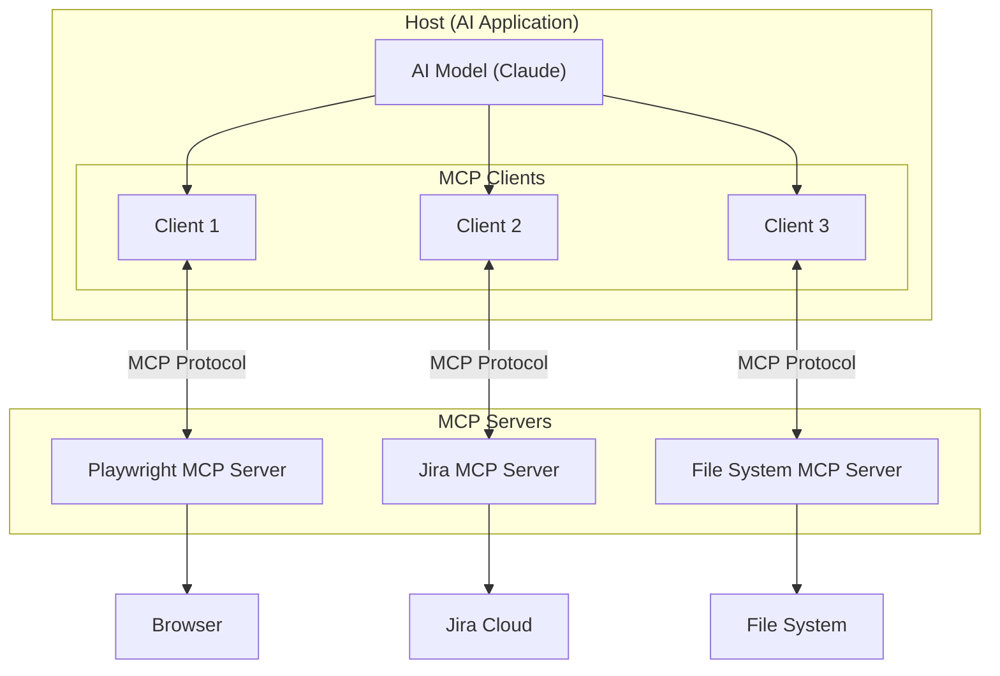
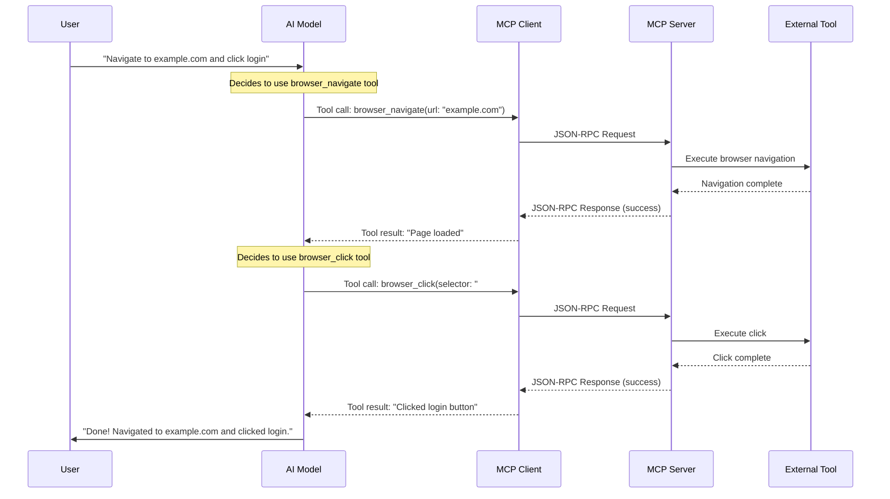
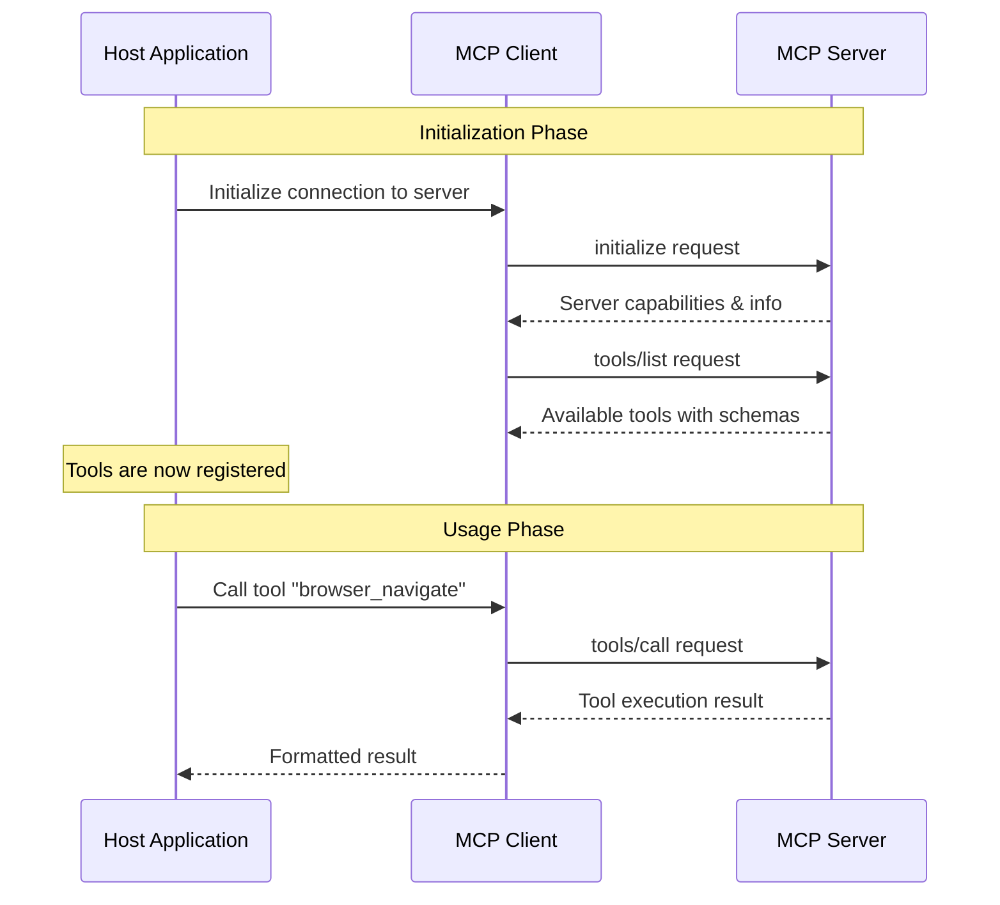
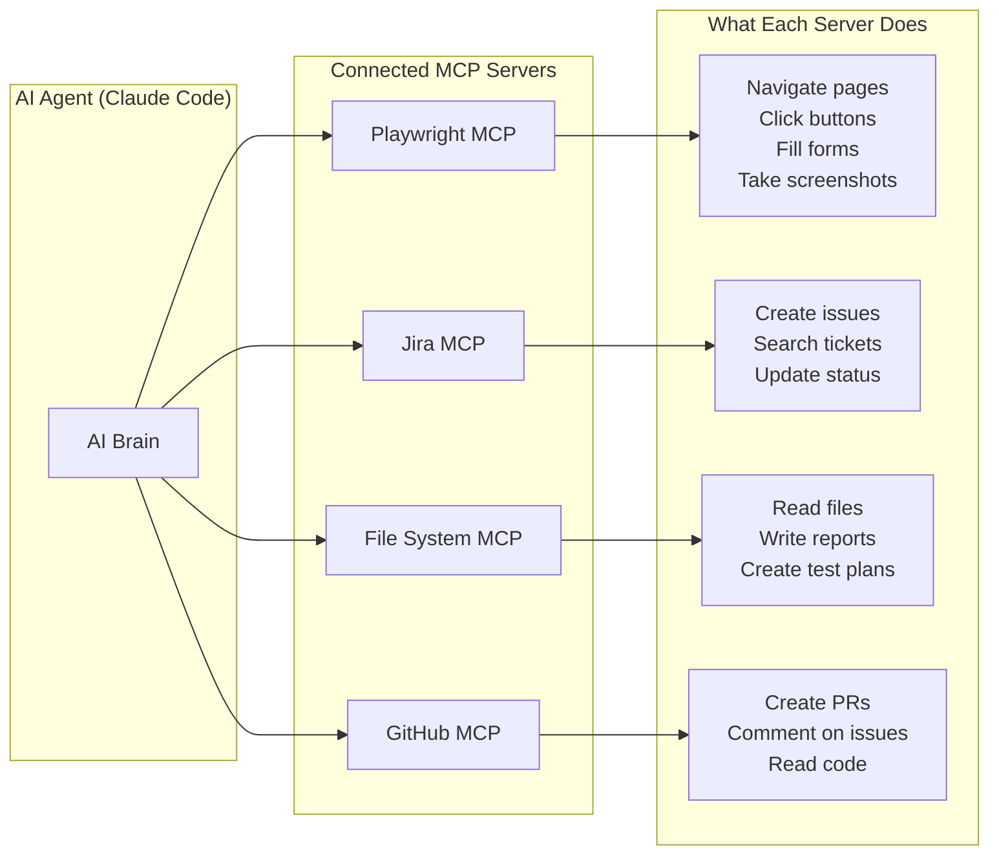
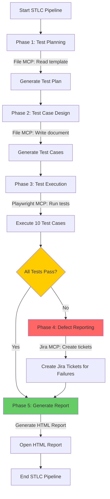

# MCP Architecture Diagrams

## 1. High-Level Architecture



**Key Insight:** One Host can connect to multiple Servers simultaneously. Each Server provides different tools, but they all speak the same MCP protocol.

---

## 2. MCP Request/Response Lifecycle



---

## 3. Tool Discovery Flow



---

## 4. stdio Transport Architecture

```
┌──────────────────────────────────────┐
│           Host Process               │
│  ┌────────────────────────────────┐  │
│  │         AI Model               │  │
│  │    (Claude / GPT / etc.)       │  │
│  └──────────┬─────────────────────┘  │
│             │                        │
│  ┌──────────▼─────────────────────┐  │
│  │       MCP Client               │  │
│  │  - Serializes requests         │  │
│  │  - Parses responses            │  │
│  └──────────┬─────────────────────┘  │
│             │                        │
│     ┌───────┴───────┐                │
│     │ Child Process │                │
│     │  ┌─────────┐  │                │
│     │  │   MCP   │  │                │
│     │  │ Server  │  │                │
│     │  └─────────┘  │                │
│     │               │                │
│     │  stdin ◄──────│── Request      │
│     │  stdout ──────│──► Response    │
│     └───────────────┘                │
└──────────────────────────────────────┘
```

---

## 5. HTTP/SSE Transport Architecture

```
┌─────────────────┐          ┌─────────────────────┐
│  Host Process    │          │   MCP Server         │
│                  │          │   (Remote Service)   │
│  ┌────────────┐  │          │                     │
│  │  AI Model  │  │          │  ┌───────────────┐  │
│  └─────┬──────┘  │          │  │  Tool Handler  │  │
│        │         │          │  └───────────────┘  │
│  ┌─────▼──────┐  │  HTTP    │                     │
│  │ MCP Client ├──┼──POST───►│  /tools/call        │
│  │            │  │          │                     │
│  │            │◄─┼──SSE─────│  Event Stream       │
│  └────────────┘  │          │                     │
└─────────────────┘          └─────────────────────┘
```

---

## 6. Multiple MCP Servers in Test Automation



---

## 7. MCP Message Format (JSON-RPC 2.0)

### Tool List Request
```json
{
  "jsonrpc": "2.0",
  "id": 1,
  "method": "tools/list"
}
```

### Tool List Response
```json
{
  "jsonrpc": "2.0",
  "id": 1,
  "result": {
    "tools": [
      {
        "name": "browser_navigate",
        "description": "Navigate to a URL in the browser",
        "inputSchema": {
          "type": "object",
          "properties": {
            "url": { "type": "string", "description": "URL to navigate to" }
          },
          "required": ["url"]
        }
      }
    ]
  }
}
```

### Tool Call Request
```json
{
  "jsonrpc": "2.0",
  "id": 2,
  "method": "tools/call",
  "params": {
    "name": "browser_navigate",
    "arguments": {
      "url": "https://example.com"
    }
  }
}
```

### Tool Call Response
```json
{
  "jsonrpc": "2.0",
  "id": 2,
  "result": {
    "content": [
      {
        "type": "text",
        "text": "Navigated to https://example.com"
      }
    ]
  }
}
```

---

## 8. STLC Automation Flow with MCP



This is the exact flow implemented in `stlc_project/mcp_scripts/06_full_stlc_pipeline.js`.
