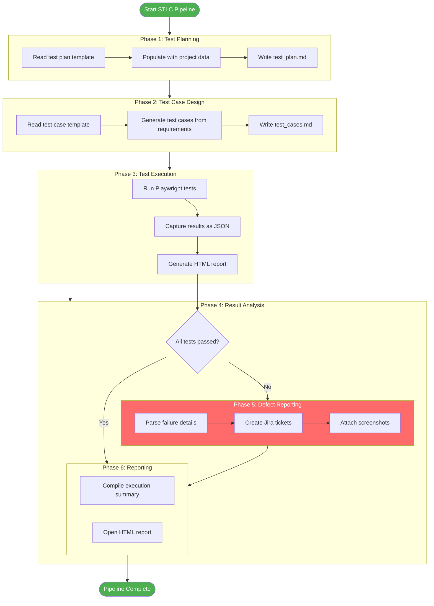
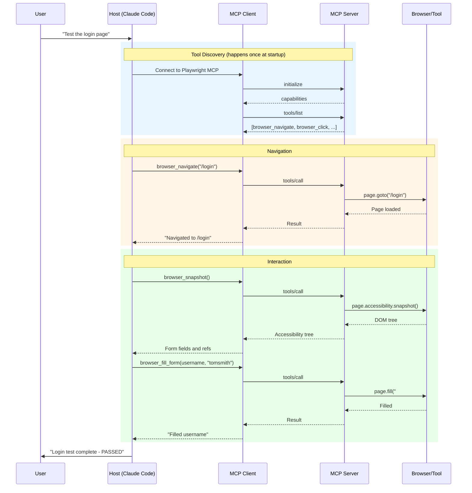
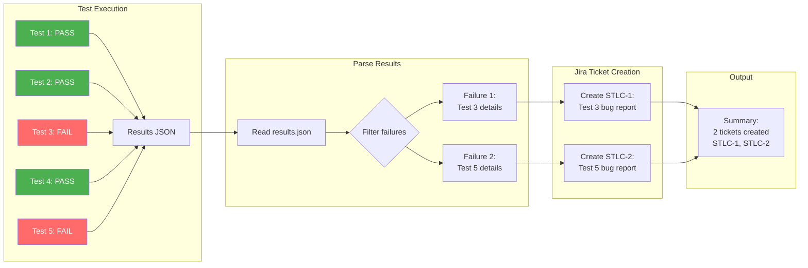
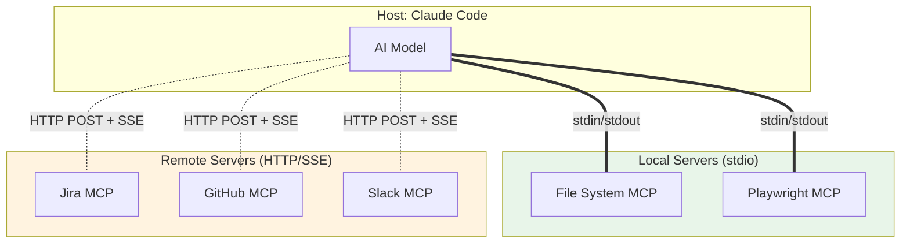
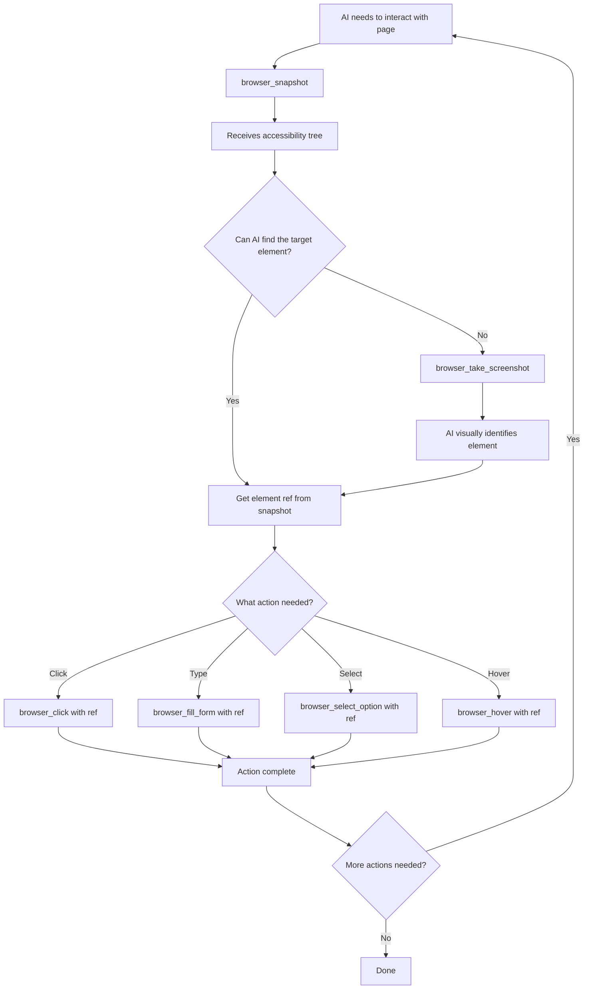

# MCP Flow Diagrams

## 1. Complete STLC Pipeline with MCP



---

## 2. MCP Tool Call Flow



---

## 3. Failure Detection and Jira Ticket Flow



---

## 4. MCP Server Connection Types



---

## 5. Playwright MCP Snapshot Workflow



---

## 6. End-to-End STLC Pipeline Script Flow

```
06_full_stlc_pipeline.js
│
├── Step 1: Generate Test Plan
│   ├── Read: templates/test_plan_template.md
│   ├── Process: Replace placeholders with project data
│   └── Write: documents/test_plan.md
│
├── Step 2: Generate Test Cases
│   ├── Read: templates/test_case_template.md
│   ├── Process: Generate 10 test case entries
│   └── Write: documents/test_cases.md
│
├── Step 3: Execute Tests
│   ├── Run: npx playwright test
│   ├── Output: reports/results.json (JSON reporter)
│   └── Output: reports/html-report/ (HTML reporter)
│
├── Step 4: Parse Results
│   ├── Read: reports/results.json
│   ├── Extract: Failed test names, errors, file paths
│   └── Return: Array of failure objects
│
├── Step 5: Create Jira Tickets (if failures exist)
│   ├── Connect: Mock Jira server (localhost:3001)
│   ├── For each failure:
│   │   ├── Create ticket with summary + description
│   │   └── Log: "Created STLC-{N}: {summary}"
│   └── Return: Array of created ticket keys
│
└── Step 6: Print Summary
    ├── Total tests: 10
    ├── Passed: 7
    ├── Failed: 3
    ├── Jira tickets created: 3
    └── HTML report: stlc_project/reports/html-report/index.html
```

---

## 7. How to Render These Diagrams

These Mermaid diagrams can be viewed in:

1. **GitHub** - Renders Mermaid natively in markdown files
2. **VS Code** - Install "Markdown Preview Mermaid Support" extension
3. **Mermaid Live Editor** - https://mermaid.live (paste the diagram code)
4. **Notion** - Supports Mermaid in code blocks
5. **Obsidian** - Built-in Mermaid support
